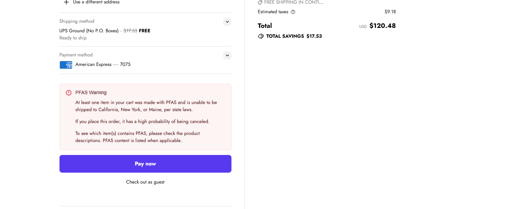

# PFAS Checkout Guardrails  
**Compliance-Driven UX & Order Flow Automation (Shopify Native)**

This repository documents a real-world compliance and customer-experience problem encountered at SCARPA North America — and how it was solved using **Shopify native tools**, automation, and thoughtful system design rather than custom code.

The project reduced prohibited PFAS orders to near-zero, eliminated manual intervention by Customer Service and Warehouse teams, and significantly improved customer clarity at checkout.

---

## 🧭 Business Context

As of **January 1, 2025**, California and New York enacted regulations prohibiting the sale of apparel and footwear containing certain **PFAS (per- and poly-fluoroalkyl substances)** compounds, large group of human-made "forever chemicals" frequently used to add water-repellancy.

Although SCARPA had already begun phasing PFAS out of its footwear line, a significant amount of legacy inventory remained in circulation at the regulatory deadline.

This created a critical operational challenge:

- Certain products could **not legally ship** to California, New York, or Maine 
- Customers were still able to **place orders**
- Compliance enforcement occurred **late in the fulfillment lifecycle**

---

## ⚠️ The Initial Problem

Before improvements were made, PFAS-restricted orders followed this pattern:

1. Customer places order (often unaware of restrictions)
2. Customer Service attempts to manually identify blocked orders
3. If missed, Warehouse/WMS blocks shipment
4. Customer is contacted **after delay**, order is canceled

### Resulting Issues
- Poor customer experience and confusion  
- High manual workload for CS and Warehouse  
- Orders canceled at the **worst possible moment** in the lifecycle  

---

## 🎯 Project Goals

- Prevent prohibited PFAS orders **before fulfillment**
- Clearly inform customers **as early as possible**
- Reduce operational burden on internal teams
- Avoid custom code or long-term technical debt

---

## 🧠 Key Assumptions

- Shopify native tools could handle the majority of logic
- Product-level metadata could drive compliance workflows
- Checkout UX was the most critical intervention point

---

## 👥 Stakeholders

- **Customer Service** – Reduced manual order review and outreach  
- **Warehouse / Fulfillment** – Fewer blocked shipments and rework  
- **Customers** – Clear expectations and fewer post-purchase surprises  

---

## 🛠️ Solution Overview

### 1️⃣ Product-Level Tagging

All products containing PFAS were tagged consistently: **PFAS**


This single source of truth enabled downstream automation without duplicating logic.

---

### 2️⃣ Order-Level Automation (Post-Order)

Using **Shopify Flow**:

- If order contains a `PFAS`-tagged product  
- AND shipping state = CA or NY  

→ Order is **automatically canceled**, **refunded**, and **customer notified**

**Impact**
- Removed the need for CS to manually audit orders  
- Still allowed customers to reach checkout unaware  

---

### 3️⃣ Checkout-Level Warning (Pre-Order)

A second Shopify automation was introduced at checkout:

- Checks cart contents for `PFAS` tag  
- Checks entered shipping state  
- If state is restricted → **prominent warning appears above the Pay button**

> ⚠️ *At least one item in your cart contains PFAS and cannot be shipped to your state per local regulations.  
If you place this order, it is likely to be canceled.*

**Outcome:**  
Customers were informed *before purchase*, dramatically reducing frustration and cancellations.




*Checkout-level warning displayed when PFAS-tagged products are shipped to restricted states.*


---

## 📈 Results

- ~99% reduction in PFAS orders to prohibited states  
- Near-elimination of CS and Warehouse manual intervention  
- Significantly improved customer clarity and trust  
- Zero custom code, minimal maintenance, low technical debt  

---

## 🧩 Why This Matters

This project demonstrates how:

- Compliance requirements can be addressed **without heavy engineering**
- Checkout UX is a powerful operational control point
- Clean data modeling enables scalable automation
- Native platform tools often outperform bespoke solutions long-term

---

## 🔍 Future Considerations

- Expand logic to additional states as regulations evolve
- Surface PFAS eligibility earlier on PDPs (geo-aware)
- Centralize compliance logic across markets

---

## 📊 Workflow Diagram

```mermaid
flowchart TD
  A[Customer adds product to cart]
  B{Product tagged PFAS?}
  C{Shipping state CA or NY?}
  D[Checkout warning displayed]
  E[Customer abandons or changes cart]
  F[Order placed]
  G[Shopify Flow auto-cancel & refund]
  H[Customer notified]
  I[Order proceeds normally]

  A --> B
  B -- No --> I
  B -- Yes --> C
  C -- No --> I
  C -- Yes --> D
  D --> E
  D --> F
  F --> G
  G --> H

